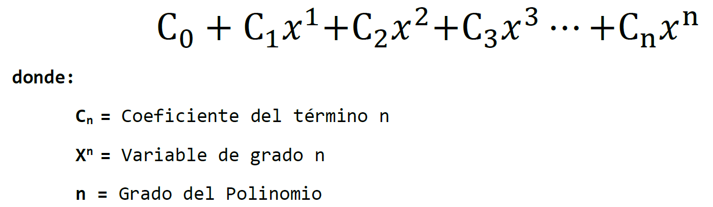
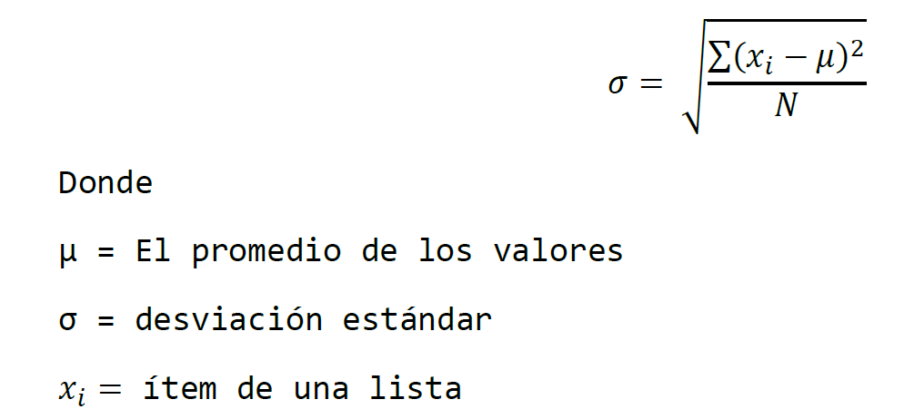

# Práctica Calificada #1 - 2021-0

Practica Calificada # 1 del curso de Programación Orientada a Objetos 2

## Indicaciones Especificas
- El tiempo límite para la evaluación es 150 minutos.
- Cada pregunta deberá ser respondida en un archivo cabecera (`.h`)  y/o en un archivo fuente (`.cpp`)
- SOLO Deberás subir los siguiente archivos directamente a [www.gradescope.com](https://www.gradescope.com) o se puede crear un `.zip` que contenga todos ellos y subirlo :
  - `polynomial.h y polynomial.cpp`
  - `standard_deviation.h`
  - `filter.h`

## Problema #1 - Polynomial (10 ptos) (clase, punteros y sobrecarga)

Se solicita implementar las clases **`polynomial`** y  **`term`**  permitan representar un polinomio de una sola variable y que pueda almacenar términos de cualquier grado numerico positivo, NO DEBEN utilizar la libreria estandar si requieren almacer los terminos dentro del polinomio deben de crear un arreglo dinamico.

**NOTA**: No olvidar liberar el arreglo dinamico al final.



**Casos de uso**
```cpp
    polinomial p1 = term{ 1, 0 } + term{ 2, 2 } + term{ 2, 4 };
    cout << p1 << endl; // 1 + 2x^2 + 2x^4;
    auto p2 = term{ 3, 4 } + term{ 2, 6 } + term{ 2, 5 };
    cout << p2 << endl; // 3x^4 + 2x^6 + 2x^5;
    auto p3 = p1 + p2;
    cout << p2 << endl; // 1 + 2x^2 + 6x^4 + 2x^6 + 2x^5;
```
## Problema #2 - filter (5 ptos) (template)

Desarrollar la función **`standard_deviation`** que contenga parámetros variados de tipo genérico (variadic) y que permita calcular la desviación estándar de todos esos términos utilizando la fórmula:


**Casos de uso**
```cpp
// Ejemplo #1:
std::cout << standard_deviation (1, 3, 4, 1, 20) << std::endl; // 7.19444 aprox.
// Ejemplo #2:
std::cout << standard_deviation (10, 13, 14, 15) << std::endl; // 1.87083 aprox.
```

## Problema #3 - filter (5 ptos) (template - STL) 
Desarrollar la función **`filter`** que tenga como primer parámetro un contenedor que podrías ser de cualquier tipo secuencial (`std::vector, std::array, std::list, std::forward_list o std::deque`) y que tenga un segundo parámetro del tipo genérico (variadic) y que permita definir las posiciones que deberán de copiarse hacia el segundo container:

**NOTA: debe controlarse y no mostrar los valores fuera de rango**

**Casos de uso**
```cpp
  // Ejemplo #1:
  std::vector vec = {1, 3, 4, 5, 6, 7};
  auto r1 = filter(vec, 5, 2, 4, 10); // r1 == {7, 4, 6} 
  // Ejemplo #2:
  std::list lst = {1, 3, 4, 5};
  auto r2 = filter(lst, 2, 0, -1); // r2 == {4, 1}.
  // Ejemplo #1:
  std::forward_list fwd_lst = {1, 3, 4, 5, 6, 7};
  auto r3 = filter(fwd_lst, 3, 2, 1); // r3 == {5, 4, 3}.
```
